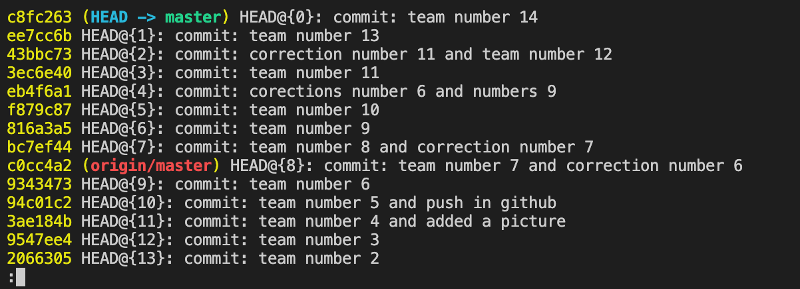

# markdown instructions

## Выделение текста

1. Чтобы выделеть текст курсивом необходимо обрамить его звездочками(*) или значком нижнего подчеркивания (_). Например, *текст1* или _текст2_
2. Чтобы выделить текст полужирным, необходимо обрамить егодвойными звездочками(**) или двойным знаком нижнего подчеркивания (__). Например, **текст1**, или __текст2__
3. Альтернативные способы выделения текста жирным или курсивом нужны для того, чтобы мы могли совмещать оба этих способа. Например, _часть текста курсив, а вторая часть теста **полужирная и курсивная**_
4. Чтобы сделат текст зачеркнутым, необходимо обрамить его двойной тильдой(~~). 
Например ~~Текст~~
5. КВозможно комбинировать все способы. Например, ~~**жирный, __курсивный__ и зачеркнутый**~~

## Списки

1. Чтобы добавить ненумерованые списки, необходимо пункты выделить звездочкой(*), например:
* Элемент 1;
* Элемент 2;
* Элемент 3;

Чтобы добавить нумерованные списки, необходимо пункты просто пронумеровать, например:
1. Элемент 1;
2. Элемент 2;
3. Элемент 3;

## Работа с изображениями

Чтобы вставить изображение в текст, достаточно написать следующее:

## Ссылки

1. Чтобы добавить ссылку с анкором необходимо в квадратны скобки добавить аккор ([анкор]), а в круглые саму ссылку ((URL)). Например [тут находится ссылка на википедью](https://ru.wikipedia.org/)

2. Чтобы добавить ссылку без анкора необходимо обрамить ее в угловые скобки (<>). Например, <https://ru.wikipedia.org/>

## Работа с таблицами

1. Чтобы в markdown рисовать таблицы необходимо использовать вертикальную черту (|) и дефис (-). Вертикальная черта служит границей между столбцами таблицы, а дефис горизонтальной границей в таблице. Например: 

|x|y|-->|
|--|--|--|
|0|0|1|
|0|1|1|
|1|0|0|
|1|1|1|

## Цитаты

1. Чтобы добавить цитату нужно перед тексом добавить угловую скобку в виде знака больше (>). Например, 
> Цитата

2. Циататы можно вкладывать друг в друга, для этого достаточно спуститься на 1 уровень ниже основной цитаты, втеперь необходимо добавить две угловые скобки (>>) далее написать необходимую цитату. Так можно делать очень много раз. Например:
> Главная цитата
>> Другая циатат
>>> Еще одна цитата
>>>> Финальная цитата

## Заключение

[подробнее тут](https://texterra.ru/blog/ischerpyvayushchaya-shpargalka-po-sintaksisu-razmetki-markdown-na-zametku-avtoram-veb-razrabotchikam.html?ysclid=l63zmogns032865696)